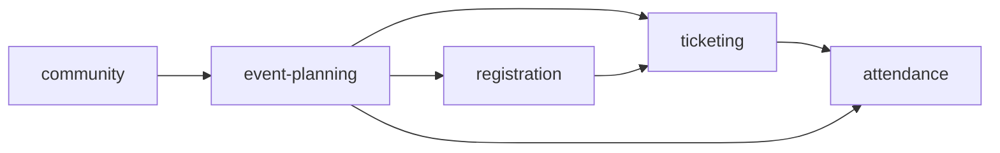
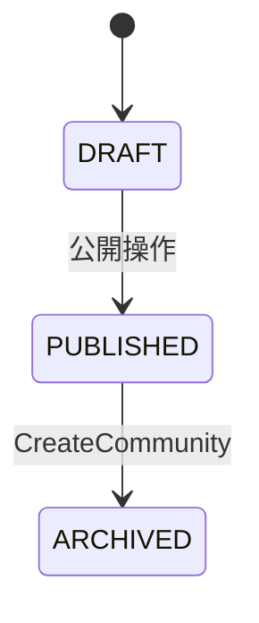
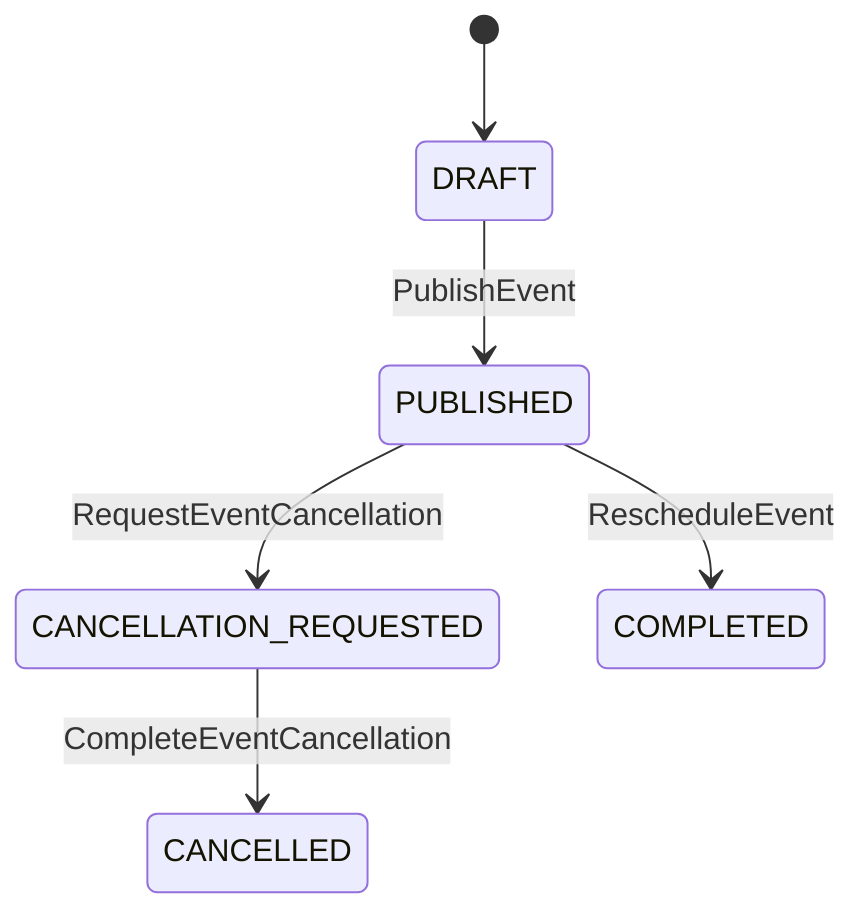
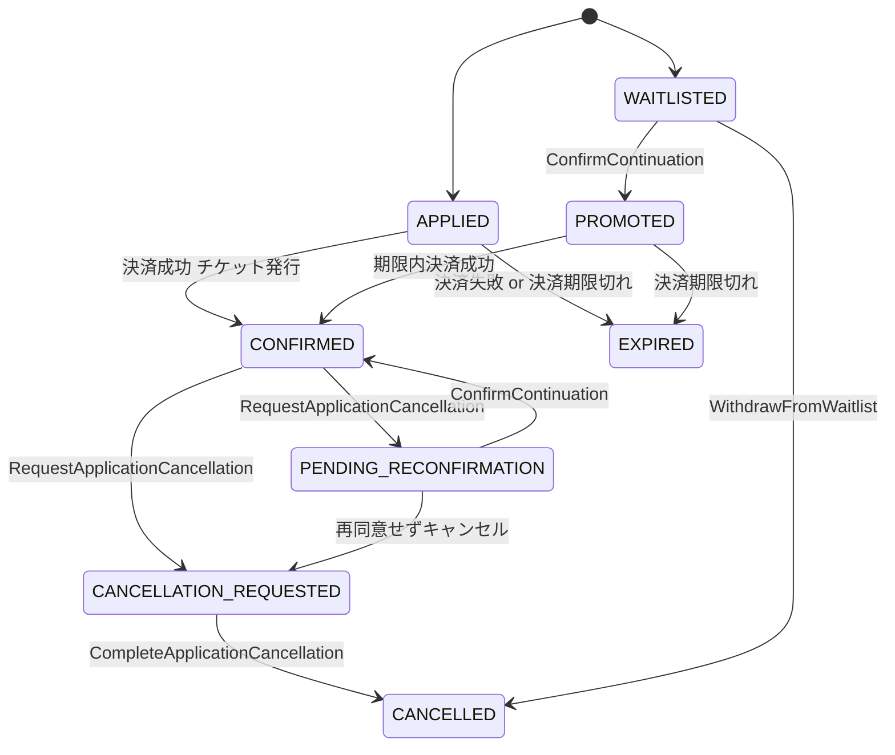
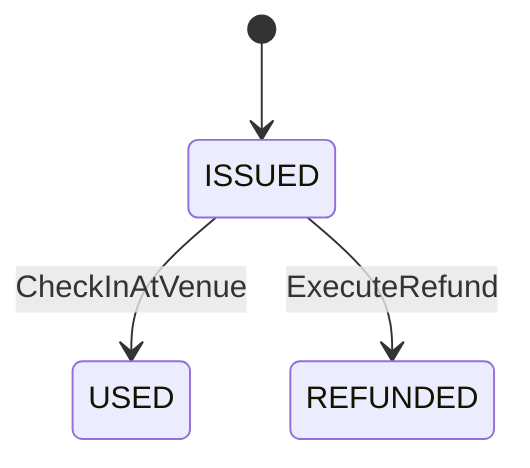
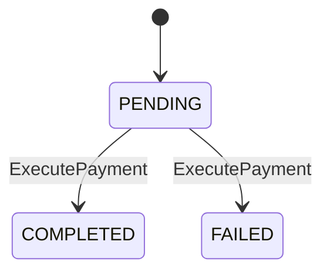
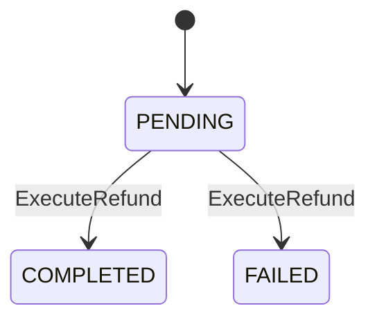

# 依存グラフ — Session 20260515-1901

> 自動生成。`build_dependency_graph.py` が再生成します。

## BC 依存関係

## 集約別 状態遷移

### agg:Community （bc:community）

### agg:Event （bc:event-planning）

### agg:Application （bc:registration）

### agg:Ticket （bc:ticketing）

### agg:Payment （bc:ticketing）

### agg:Refund （bc:ticketing）

## AGG 跨ぎシナリオ

- **システムが返金を実行する**: `agg:Ticket`, `agg:Refund` → CMD `ExecuteRefund`
- **参加者が会場で受付する**: `agg:Ticket`, `agg:Attendance` → CMD `CheckInAtVenue`
- **参加者がオンラインで参加する**: `agg:Ticket`, `agg:Attendance` → CMD `JoinOnline`
