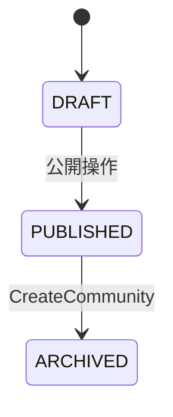

# [bc:community][agg:Community] Community 集約（コミュニティ）

<!-- es-key: bc/community/agg/Community -->

## 実装担当範囲
- **BC (大項目)**: `bc:community`
- **AGG (中項目)**: `agg:Community`
- **スコープ**: この AGG の全 CMD / QRY / 受信 POLICY を 1 PR で実装
- **原則**: 1 AGG = 1 オーナー = 1 PR (AI エージェント 1 担当)
- **本 Epic 外**: AGG 跨ぎ統合 Issue で扱う処理は別 Issue（下記「AGG 跨ぎ統合 Issue への参加」参照）

## Aggregate 概要
コミュニティ 集約。

## スキーマ (Zod)

```typescript
export const CommunityIdSchema = z.string().uuid().brand<'CommunityId'>();
export const MemberIdSchema = z.string().uuid().brand<'MemberId'>();

export const CommunitySchema = z.object({
  id: CommunityIdSchema,
  name: z.string().min(1).max(100),
  description: z.string().min(1).max(2000),
  ownerId: MemberIdSchema,
  status: z.enum(['DRAFT', 'PUBLISHED', 'ARCHIVED']),
  members: z.array(MemberIdSchema),
  createdAt: z.date(),
});
export type Community = z.infer<typeof CommunitySchema>;
```

## 不変条件 (RULE)
- コミュニティ名はシステム全体で一意
- name と description は空にできない
- ownerId は必ず存在する（コミュニティ作成者）
- members に重複はない
- ownerId は退会できない（先にコミュニティを ARCHIVED にする必要がある）

## エラー (ERR)
- `DuplicateCommunityNameError`: 同名のコミュニティが既に存在する
- `InvalidCommunityDataError`: name または description が空
- `CommunityNotAvailableError`: PUBLISHED 状態ではないコミュニティに参加しようとした
- `AlreadyMemberError`: 既にメンバーであるユーザーが再度参加しようとした
- `NotMemberError`: メンバーでないユーザーが退会しようとした
- `OwnerCannotLeaveError`: 主催者が退会しようとした（先にコミュニティを ARCHIVE すること）

## 状態モデル

状態: `ARCHIVED` | `DRAFT` | `PUBLISHED`

## 状態遷移 (State Transitions)



## 状態遷移を起こす CMD（一覧）

| from | to | CMD | Issue | RULE |
|---|---|---|---|---|
| `DRAFT` | `PUBLISHED` | `公開操作` | (未起票) | 公開操作 |
| `PUBLISHED` | `ARCHIVED` | `CreateCommunity` | (未起票) | 主催者による閉鎖 |

## 状態遷移を起こす CMD（詳細）

### `公開操作` — `DRAFT` → `PUBLISHED`
- **由来シナリオ**: 公開操作
- (DML SCENARIO 未紐付け — 入力/EVT/RULE は AGG schema と不変条件から推定)

### `CreateCommunity` — `PUBLISHED` → `ARCHIVED`
- **由来シナリオ**: 主催者による閉鎖
- **アクター**: `Organizer`
- **発火 EVT**: `CommunityCreated`
- **適用 RULE**:
  - communityName must be unique system-wide
  - name and description must not be empty
- **想定 ERR**:
  - duplicateName → DuplicateCommunityNameError
  - emptyName → InvalidCommunityDataError

## 状態を変えない CMD（属性更新・一覧）

| CMD | 由来シナリオ | Issue |
|---|---|---|
| `JoinCommunity` | 参加者がコミュニティに参加する | (未起票) |
| `LeaveCommunity` | メンバーがコミュニティを退会する | (未起票) |

## 状態を変えない CMD（詳細）

### `JoinCommunity`
- **由来シナリオ**: 参加者がコミュニティに参加する
- **アクター**: `Member`
- **発火 EVT**: `MemberJoined`
- **適用 RULE**:
  - community must be in PUBLISHED status
  - member must not already be a member
- **想定 ERR**:
  - notPublished → CommunityNotAvailableError
  - duplicateMember → AlreadyMemberError

### `LeaveCommunity`
- **由来シナリオ**: メンバーがコミュニティを退会する
- **アクター**: `Member`
- **発火 EVT**: `MemberLeft`
- **適用 RULE**:
  - member must be an active member and not the owner
- **想定 ERR**:
  - notMember → NotMemberError
  - isOwner → OwnerCannotLeaveError

## QRY（読み出し口・詳細）

（なし）

## 受信 POLICY (inbound: 他 AGG / BC の EVT に反応してこの AGG の CMD を発火)

（なし — この AGG は他 AGG/BC からの EVT 駆動を持たない）

## 発信イベント (outbound: この AGG が発火する EVT とその消費先)

### EVT `CommunityCreated`
- **発火 CMD** (この AGG 内): `CreateCommunity`
- 消費 POLICY: （現状なし — 観測用 EVT、または下流未モデル）

### EVT `MemberJoined`
- **発火 CMD** (この AGG 内): `JoinCommunity`
- 消費 POLICY: （現状なし — 観測用 EVT、または下流未モデル）

### EVT `MemberLeft`
- **発火 CMD** (この AGG 内): `LeaveCommunity`
- 消費 POLICY: （現状なし — 観測用 EVT、または下流未モデル）

## 推奨モジュール構造

```
src/<bc>/<aggregate>/
  index.ts       — Aggregate root + 不変条件
  schema.ts      — Zod schemas
  commands/      — 1 CMD = 1 file
  queries/       — 1 QRY = 1 file
  events.ts      — EVT 定義
  errors.ts      — ERR 定義
  policies.ts    — 受信 POLICY ハンドラ
tests/<bc>/<aggregate>/<aggregate>.spec.ts
```

## 受け入れ条件
- [ ] Zod スキーマが Epic 記載と一致
- [ ] 状態遷移図の全エッジが実装されテストでカバー
- [ ] 全不変条件 (RULE) が enforce され、違反時に Epic 記載の ERR が発火
- [ ] 全 CMD / QRY が公開 API として動作
- [ ] 受信 POLICY 全件のハンドラが実装され、テストで TRIGGER EVT → CMD 発火が検証されている
- [ ] 発信 EVT 全件が CMD 成功時に確実に publish され、ペイロード schema が一致
- [ ] POLICY の冪等性（重複 EVT 受信時の重複 CMD 防止）がテストでカバー
- [ ] 上流 BC との依存が adapter / port パターンで分離（cross-BC POLICY 含む）
- [ ] AGG 跨ぎ統合 Issue で扱う処理は本 Epic 外（参照 link のみ）

## AGG 跨ぎ統合 Issue への参加
- （なし）

## Depends on
- なし

## Source
- セッション MD: `docs/eventstorming/eventstorming-20260515-1901.md`
