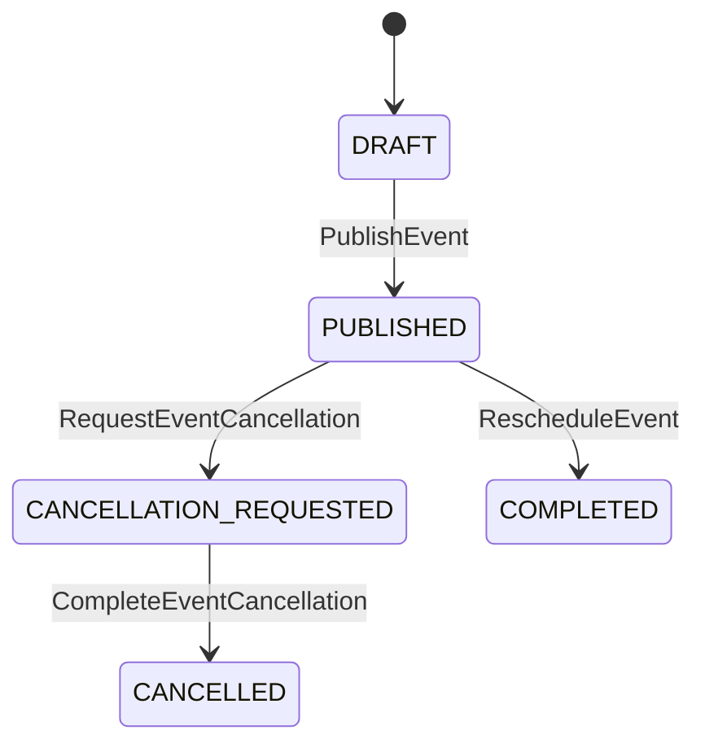

# [bc:event-planning][agg:Event] Event 集約（イベント）

<!-- es-key: bc/event-planning/agg/Event -->

## 実装担当範囲
- **BC (大項目)**: `bc:event-planning`
- **AGG (中項目)**: `agg:Event`
- **スコープ**: この AGG の全 CMD / QRY / 受信 POLICY を 1 PR で実装
- **原則**: 1 AGG = 1 オーナー = 1 PR (AI エージェント 1 担当)
- **本 Epic 外**: AGG 跨ぎ統合 Issue で扱う処理は別 Issue（下記「AGG 跨ぎ統合 Issue への参加」参照）

## Aggregate 概要
イベント 集約。

## スキーマ (Zod)

```typescript
export const EventIdSchema = z.string().uuid().brand<'EventId'>();
export const PriceSchema = z.object({
  amount: z.number().int().nonnegative(),
  currency: z.literal('JPY'),
});

export const EventSchema = z.object({
  id: EventIdSchema,
  communityId: CommunityIdSchema,
  title: z.string().min(1).max(200),
  description: z.string().max(5000),
  startDateTime: z.date(),
  endDateTime: z.date(),
  venueName: z.string().nullable(),
  venueAddress: z.string().nullable(),
  venueCapacity: z.number().int().nonnegative(),
  onlineCapacity: z.number().int().nonnegative(),
  streamUrl: z.string().url().nullable(),
  memberPrice: PriceSchema,
  generalPrice: PriceSchema,
  status: z.enum([
    'DRAFT',
    'PUBLISHED',
    'CANCELLATION_REQUESTED',
    'CANCELLED',
    'COMPLETED',
  ]),
  createdAt: z.date(),
});
export type Event = z.infer<typeof EventSchema>;
```

## 不変条件 (RULE)
- 既存コミュニティに紐づくこと
- venueCapacity と onlineCapacity は非負整数
- 少なくとも一方は正の値である（両方0は不可）
- venueCapacity > 0 のとき venueName と venueAddress は必須
- onlineCapacity > 0 のとき streamUrl は PUBLISHED 時までに必須
- startDateTime は createdAt より未来
- endDateTime は startDateTime より後
- memberPrice ≤ generalPrice（メンバー優遇）
- 公開後の `venueCapacity` / `onlineCapacity` は減少不可（増加のみ）
- 開催済みイベントはキャンセル不可

## エラー (ERR)
- `CommunityNotFoundError`: communityId に対応する Community が存在しない
- `InvalidCapacityError`: 両定員が 0、または減少しようとした
- `InvalidScheduleError`: startDateTime が過去、または endDateTime が startDateTime 以前
- `InvalidEventDataError`: PUBLISHED に必要な項目が未入力
- `InvalidStatusTransitionError`: 許可されない状態遷移
- `EventAlreadyOccurredError`: 開催済みイベントに対する中止操作
- `EventAlreadyCancelledError`: 既に中止されたイベントへの再中止
- `ParticipationTypeChangeNotAllowedError`: 会場枠⇔オンライン枠の構成変更（RelocateEvent では不可）
- `RefundsPendingError`: 全返金が完了する前に中止確定しようとした
- `EventNotStartedYetError`: startDateTime 通過前に開催完了させようとした

## 状態モデル

状態: `CANCELLATION_REQUESTED` | `CANCELLED` | `COMPLETED` | `DRAFT` | `PUBLISHED`

## 状態遷移 (State Transitions)



## 状態遷移を起こす CMD（一覧）

| from | to | CMD | Issue | RULE |
|---|---|---|---|---|
| `DRAFT` | `PUBLISHED` | `PublishEvent` | (未起票) | 公開操作（必須項目チェック） |
| `PUBLISHED` | `CANCELLATION_REQUESTED` | `RequestEventCancellation` | (未起票) | 主催者による中止要求 |
| `CANCELLATION_REQUESTED` | `CANCELLED` | `CompleteEventCancellation` | (未起票) | 全返金完了で確定 |
| `PUBLISHED` | `COMPLETED` | `RescheduleEvent` | (未起票) | 開催完了操作（開催日時通過後） |

## 状態遷移を起こす CMD（詳細）

### `PublishEvent` — `DRAFT` → `PUBLISHED`
- **由来シナリオ**: 公開操作（必須項目チェック）
- **アクター**: `Organizer`
- **発火 EVT**: `EventPublished`
- **適用 RULE**:
  - event must be in DRAFT status
  - all required fields must be filled
- **想定 ERR**:
  - alreadyPublished → InvalidStatusTransitionError
  - incompleteData → InvalidEventDataError

### `RequestEventCancellation` — `PUBLISHED` → `CANCELLATION_REQUESTED`
- **由来シナリオ**: 主催者による中止要求
- **アクター**: `Organizer`
- **発火 EVT**: `EventCancellationRequested`
- **適用 RULE**:
  - event must not have already occurred
  - event must not be already CANCELLED
- **想定 ERR**:
  - eventAlreadyOccurred → EventAlreadyOccurredError
  - alreadyCancelled → EventAlreadyCancelledError
- **連鎖 POLICY**: `RefundAllOnEventCancellation`

### `CompleteEventCancellation` — `CANCELLATION_REQUESTED` → `CANCELLED`
- **由来シナリオ**: 全返金完了で確定
- **アクター**: `System`
- **発火 EVT**: `EventCancellationCompleted`
- **適用 RULE**:
  - all confirmed applications must have been refunded
- **想定 ERR**:
  - pendingRefunds → RefundsPendingError

### `RescheduleEvent` — `PUBLISHED` → `COMPLETED`
- **由来シナリオ**: 開催完了操作（開催日時通過後）
- **アクター**: `Organizer`
- **発火 EVT**: `EventRescheduled`
- **適用 RULE**:
  - event must be PUBLISHED and not started
  - new dateTime must be in the future
- **想定 ERR**:
  - invalidStatus → InvalidStatusTransitionError
  - pastDateTime → InvalidScheduleError
- **連鎖 POLICY**: `ReconfirmOnEventReschedule`

## 状態を変えない CMD（属性更新・一覧）

| CMD | 由来シナリオ | Issue |
|---|---|---|
| `CreateEvent` | 主催者がイベントを作成する | (未起票) |
| `IncreaseCapacity` | 主催者が定員を増やす | (未起票) |
| `RelocateEvent` | 主催者が会場を変更する | (未起票) |
| `RepriceEvent` | 主催者が料金を変更する | (未起票) |

## 状態を変えない CMD（詳細）

### `CreateEvent`
- **由来シナリオ**: 主催者がイベントを作成する
- **アクター**: `Organizer`
- **発火 EVT**: `EventCreated`
- **適用 RULE**:
  - event must belong to an existing community
  - venueCapacity and onlineCapacity must be non-negative
  - at least one of venueCapacity or onlineCapacity must be positive
  - startDateTime must be in the future
  - memberPrice must be less than or equal to generalPrice
- **想定 ERR**:
  - communityNotFound → CommunityNotFoundError
  - invalidCapacity → InvalidCapacityError
  - pastDateTime → InvalidScheduleError

### `IncreaseCapacity`
- **由来シナリオ**: 主催者が定員を増やす
- **アクター**: `Organizer`
- **発火 EVT**: `CapacityIncreased`
- **適用 RULE**:
  - event must be PUBLISHED and not CANCELLED
  - new capacity must be greater than current capacity
- **想定 ERR**:
  - invalidStatus → InvalidStatusTransitionError
  - notIncrease → InvalidCapacityError
- **連鎖 POLICY**: `PromoteWaitlistOnCapacityIncrease`

### `RelocateEvent`
- **由来シナリオ**: 主催者が会場を変更する
- **アクター**: `Organizer`
- **発火 EVT**: `EventRelocated`
- **適用 RULE**:
  - event must be PUBLISHED and not started
  - must not change participation type composition
- **想定 ERR**:
  - invalidStatus → InvalidStatusTransitionError
  - typeChange → ParticipationTypeChangeNotAllowedError
- **連鎖 POLICY**: `NotifyOnEventRelocation`

### `RepriceEvent`
- **由来シナリオ**: 主催者が料金を変更する
- **アクター**: `Organizer`
- **発火 EVT**: `EventRepriced`
- **適用 RULE**:
  - event must be PUBLISHED and not started
  - price change applies only to future applications
- **想定 ERR**:
  - invalidStatus → InvalidStatusTransitionError
- **連鎖 POLICY**: `ReconfirmOnEventReprice`

## QRY（読み出し口・詳細）

### `GetEventDetails`
- **目的**: タイトル・日時・会場・残席・料金を一覧表示し、申込判断を可能にする
- **利用者**: 参加者（`参加を申し込む` の判断材料）
- **ソース**: `event-planning.Event` + `registration.Application` 集約（残席計算）
- **算出**: `venueRemaining = Event.venueCapacity − count(Application.status ∈ {APPLIED, CONFIRMED, PROMOTED} AND participationType = VENUE)`、ONLINE 枠も同様

### `GetRemainingCapacity`
- **目的**: APPLIED/WAITLISTED の振り分けを決定する
- **利用者**: 参加者（`参加を申し込む` の WHEN 分岐判断）と Application AGG 自身（不変条件チェック）
- **ソース**: `Event` + `Application`
- **算出**: GetEventDetails と同じ計算式を `participationType` 別に算出

### `GetPendingRefundsForEvent`
- **目的**: 全 confirmed 申込のうち、まだ EventRefundCompleted が届いていない件数を取得（ゼロ件なら中止確定可）
- **利用者**: POLICY `CompleteEventCancellationOnAllRefunded`（中止確定の判定）
- **ソース**: `event-planning.Event` + `ticketing.Refund`（reason = EVENT_CANCEL の COMPLETED 件数）
- **算出**: `count(Application[eventId=?, status=CONFIRMED at time of cancellation]) − count(Refund[eventId=?, reason=EVENT_CANCEL, status=COMPLETED])`

### `GetStreamUrl`
- **目的**: オンライン参加者に配信 URL を提供
- **利用者**: 参加者（`オンライン参加` の判断 — URL がないと参加できない）
- **ソース**: `event-planning.Event.streamUrl` + 当該 Ticket の有効性
- **算出**: 単一ルックアップ + Ticket 検証

## 受信 POLICY (inbound: 他 AGG / BC の EVT に反応してこの AGG の CMD を発火)

### `CompleteEventCancellationOnAllRefunded`
- **TRIGGER EVT**: `EventRefundCompleted` ← (発生元未解決)
- **QRY** (BULK 対象選択): `GetPendingRefundsForEvent`
- **発火 CMD** (この AGG 内): `CompleteEventCancellation`
- **BULK**: false
- メモ: 全 confirmed 申込の返金完了でイベント中止を確定 / [?] Saga インスタンス管理: eventId 単位で EventRefundCompleted を累積し、 / QRY で残返金件数を確認 → ゼロ件で CompleteEventCancellation を発行

## 発信イベント (outbound: この AGG が発火する EVT とその消費先)

### EVT `EventCreated`
- **発火 CMD** (この AGG 内): `CreateEvent`
- 消費 POLICY: （現状なし — 観測用 EVT、または下流未モデル）

### EVT `EventPublished`
- **発火 CMD** (この AGG 内): `PublishEvent`
- 消費 POLICY: （現状なし — 観測用 EVT、または下流未モデル）

### EVT `CapacityIncreased`
- **発火 CMD** (この AGG 内): `IncreaseCapacity`
- **消費 POLICY**:
  - `PromoteWaitlistOnCapacityIncrease` → `agg:Application.PromoteWaitlistEntry` (`bc:registration`) ⚠ cross-BC

### EVT `EventRescheduled`
- **発火 CMD** (この AGG 内): `RescheduleEvent`
- **消費 POLICY**:
  - `ReconfirmOnEventReschedule` → `agg:Application.RequestReconfirmation` (`bc:registration`) ⚠ cross-BC

### EVT `EventRelocated`
- **発火 CMD** (この AGG 内): `RelocateEvent`
- 消費 POLICY: （現状なし — 観測用 EVT、または下流未モデル）

### EVT `EventRepriced`
- **発火 CMD** (この AGG 内): `RepriceEvent`
- **消費 POLICY**:
  - `ReconfirmOnEventReprice` → `agg:Application.RequestReconfirmation` (`bc:registration`) ⚠ cross-BC

### EVT `EventCancellationRequested`
- **発火 CMD** (この AGG 内): `RequestEventCancellation`
- **消費 POLICY**:
  - `RefundAllOnEventCancellation` → `agg:Refund.ExecuteRefund` (`bc:ticketing`) ⚠ cross-BC

### EVT `EventCancellationCompleted`
- **発火 CMD** (この AGG 内): `CompleteEventCancellation`
- **消費 POLICY**:
  - `CancelApplicationsOnEventCancellation` → `agg:Application.CancelApplicationDueToEventCancel` (`bc:registration`) ⚠ cross-BC

### EVT `EventCompleted`
- **発火 CMD** (この AGG 内): `CompleteEvent`
- 消費 POLICY: （現状なし — 観測用 EVT、または下流未モデル）

## 副作用専用 POLICY (この AGG の EVT を観測、CMD は発火しない)


### `NotifyOnEventRelocation`
- **TRIGGER**: `EventRelocated` (この AGG 発)
- **QRY**: `GetConfirmedApplications`
- **観測 EVT**: `ChangeNotified`
- メモ: 会場変更は通知のみ（再同意不要） / 副作用専用 POLICY: 外部通知サービス（メール / プッシュ）を recipient ごとに呼び出す。 / AGG 更新は伴わないため CMD / SCENARIO は宣言せず、ChangeNotified を観測用に発行するのみ。
- 実装: 外部通知サービス等の adapter 経由、AGG 状態は変更しない
## 推奨モジュール構造

```
src/<bc>/<aggregate>/
  index.ts       — Aggregate root + 不変条件
  schema.ts      — Zod schemas
  commands/      — 1 CMD = 1 file
  queries/       — 1 QRY = 1 file
  events.ts      — EVT 定義
  errors.ts      — ERR 定義
  policies.ts    — 受信 POLICY ハンドラ
tests/<bc>/<aggregate>/<aggregate>.spec.ts
```

## 受け入れ条件
- [ ] Zod スキーマが Epic 記載と一致
- [ ] 状態遷移図の全エッジが実装されテストでカバー
- [ ] 全不変条件 (RULE) が enforce され、違反時に Epic 記載の ERR が発火
- [ ] 全 CMD / QRY が公開 API として動作
- [ ] 受信 POLICY 全件のハンドラが実装され、テストで TRIGGER EVT → CMD 発火が検証されている
- [ ] 発信 EVT 全件が CMD 成功時に確実に publish され、ペイロード schema が一致
- [ ] POLICY の冪等性（重複 EVT 受信時の重複 CMD 防止）がテストでカバー
- [ ] 上流 BC との依存が adapter / port パターンで分離（cross-BC POLICY 含む）
- [ ] AGG 跨ぎ統合 Issue で扱う処理は本 Epic 外（参照 link のみ）

## AGG 跨ぎ統合 Issue への参加
- （なし）

## Depends on
- 上流 BC: `bc:community`

## Source
- セッション MD: `docs/eventstorming/eventstorming-20260515-1901.md`
