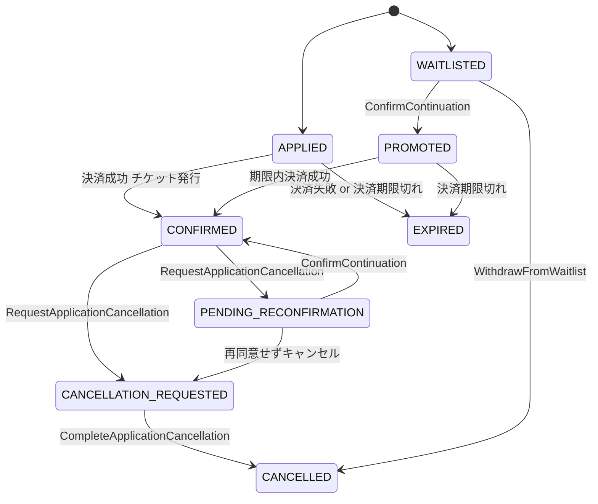

# [bc:registration][agg:Application] Application 集約（申込）

<!-- es-key: bc/registration/agg/Application -->

## 実装担当範囲
- **BC (大項目)**: `bc:registration`
- **AGG (中項目)**: `agg:Application`
- **スコープ**: この AGG の全 CMD / QRY / 受信 POLICY を 1 PR で実装
- **原則**: 1 AGG = 1 オーナー = 1 PR (AI エージェント 1 担当)
- **本 Epic 外**: AGG 跨ぎ統合 Issue で扱う処理は別 Issue（下記「AGG 跨ぎ統合 Issue への参加」参照）

## Aggregate 概要
申込 集約。

## スキーマ (Zod)

```typescript
export const ApplicationIdSchema = z.string().uuid().brand<'ApplicationId'>();
export const ParticipationTypeSchema = z.enum(['VENUE', 'ONLINE']);

export const ApplicationSchema = z.object({
  id: ApplicationIdSchema,
  eventId: EventIdSchema,
  memberId: MemberIdSchema,
  participationType: ParticipationTypeSchema,
  status: z.enum([
    'APPLIED',
    'CONFIRMED',
    'WAITLISTED',
    'PROMOTED',
    'PENDING_RECONFIRMATION',
    'CANCELLATION_REQUESTED',
    'CANCELLED',
    'EXPIRED',
  ]),
  paymentDeadline: z.date().nullable(),
  waitlistPosition: z.number().int().positive().nullable(),
  appliedAt: z.date(),
});
export type Application = z.infer<typeof ApplicationSchema>;
```

## 不変条件 (RULE)
- イベントは PUBLISHED 状態である
- 同一メンバー × 同一イベントの active な Application は 1 つまで（CANCELLED/EXPIRED は除外）
- participationType は Event の利用可能枠と一致する
- WAITLISTED 状態のときのみ `waitlistPosition` が非 null
- APPLIED / PROMOTED 状態のときのみ `paymentDeadline` が非 null（24 時間後）
- CONFIRMED 状態に到達するには対応する Ticket が存在する
- 開催開始後はキャンセル要求不可

## エラー (ERR)
- `EventNotAvailableError`: イベントが PUBLISHED でない
- `AlreadyAppliedError`: 同一イベントに既に active な申込がある
- `InvalidParticipationTypeError`: 選択した participationType に Event の枠がない
- `InvalidStatusTransitionError`: 許可されない状態遷移
- `EventAlreadyStartedError`: 開催開始後のキャンセル要求

## 状態モデル

状態: `APPLIED` | `CANCELLATION_REQUESTED` | `CANCELLED` | `CONFIRMED` | `EXPIRED` | `PENDING_RECONFIRMATION` | `PROMOTED` | `WAITLISTED`

## 状態遷移 (State Transitions)



## 状態遷移を起こす CMD（一覧）

| from | to | CMD | Issue | RULE |
|---|---|---|---|---|
| `APPLIED` | `CONFIRMED` | `決済成功 + チケット発行` | (未起票) | 決済成功 + チケット発行 |
| `APPLIED` | `EXPIRED` | `決済失敗 or 決済期限切れ` | (未起票) | 決済失敗 or 決済期限切れ |
| `WAITLISTED` | `PROMOTED` | `ConfirmContinuation` | (未起票) | 繰り上げ通知（24h 決済期限付き） |
| `PENDING_RECONFIRMATION` | `CONFIRMED` | `ConfirmContinuation` | (未起票) | 継続参加を選択 |
| `PROMOTED` | `CONFIRMED` | `期限内決済成功` | (未起票) | 期限内決済成功 |
| `PROMOTED` | `EXPIRED` | `決済期限切れ` | (未起票) | 決済期限切れ |
| `CONFIRMED` | `CANCELLATION_REQUESTED` | `RequestApplicationCancellation` | (未起票) | キャンセル要求 |
| `CONFIRMED` | `PENDING_RECONFIRMATION` | `RequestApplicationCancellation` | (未起票) | 日時・料金変更で再同意要求 |
| `CANCELLATION_REQUESTED` | `CANCELLED` | `CompleteApplicationCancellation` | (未起票) | 返金完了で確定 |
| `WAITLISTED` | `CANCELLED` | `WithdrawFromWaitlist` | (未起票) | キャンセル待ち取下げ（返金不要） |
| `PENDING_RECONFIRMATION` | `CANCELLATION_REQUESTED` | `再同意せずキャンセル` | (未起票) | 再同意せずキャンセル |

## 状態遷移を起こす CMD（詳細）

### `決済成功 + チケット発行` — `APPLIED` → `CONFIRMED`
- **由来シナリオ**: 決済成功 + チケット発行
- (DML SCENARIO 未紐付け — 入力/EVT/RULE は AGG schema と不変条件から推定)

### `決済失敗 or 決済期限切れ` — `APPLIED` → `EXPIRED`
- **由来シナリオ**: 決済失敗 or 決済期限切れ
- (DML SCENARIO 未紐付け — 入力/EVT/RULE は AGG schema と不変条件から推定)

### `ConfirmContinuation` — `WAITLISTED` → `PROMOTED`, `PENDING_RECONFIRMATION` → `CONFIRMED`
- **由来シナリオ**: 繰り上げ通知（24h 決済期限付き）
- **アクター**: `Member`
- **発火 EVT**: `ContinuationConfirmed`
- **適用 RULE**:
  - application must be in PENDING_RECONFIRMATION status
- **想定 ERR**:
  - invalidStatus → InvalidStatusTransitionError

### `期限内決済成功` — `PROMOTED` → `CONFIRMED`
- **由来シナリオ**: 期限内決済成功
- (DML SCENARIO 未紐付け — 入力/EVT/RULE は AGG schema と不変条件から推定)

### `決済期限切れ` — `PROMOTED` → `EXPIRED`
- **由来シナリオ**: 決済期限切れ
- (DML SCENARIO 未紐付け — 入力/EVT/RULE は AGG schema と不変条件から推定)

### `RequestApplicationCancellation` — `CONFIRMED` → `CANCELLATION_REQUESTED`, `CONFIRMED` → `PENDING_RECONFIRMATION`
- **由来シナリオ**: キャンセル要求
- **アクター**: `Member`
- **発火 EVT**: `ApplicationCancellationRequested`
- **適用 RULE**:
  - application must be in CONFIRMED or PENDING_RECONFIRMATION status
  - event must not have already started
- **想定 ERR**:
  - invalidStatus → InvalidStatusTransitionError
  - eventAlreadyStarted → EventAlreadyStartedError
- **連鎖 POLICY**: `RefundOnApplicationCancellation`

### `CompleteApplicationCancellation` — `CANCELLATION_REQUESTED` → `CANCELLED`
- **由来シナリオ**: 返金完了で確定
- **アクター**: `System`
- **発火 EVT**: `ApplicationCancellationCompleted`
- **適用 RULE**:
  - refund must have been completed with reason = MEMBER_CANCEL
- **連鎖 POLICY**: `PromoteWaitlistOnCancellation`

### `WithdrawFromWaitlist` — `WAITLISTED` → `CANCELLED`
- **由来シナリオ**: キャンセル待ち取下げ（返金不要）
- **アクター**: `Member`
- **発火 EVT**: `WaitlistEntryRemoved`
- **適用 RULE**:
  - application must be in WAITLISTED status
- **想定 ERR**:
  - invalidStatus → InvalidStatusTransitionError

### `再同意せずキャンセル` — `PENDING_RECONFIRMATION` → `CANCELLATION_REQUESTED`
- **由来シナリオ**: 再同意せずキャンセル
- (DML SCENARIO 未紐付け — 入力/EVT/RULE は AGG schema と不変条件から推定)

## 状態を変えない CMD（属性更新・一覧）

| CMD | 由来シナリオ | Issue |
|---|---|---|
| `ApplyForEvent` | 参加者がイベント詳細を確認して参加を申し込む | (未起票) |
| `PromoteWaitlistEntry` | システムがキャンセル待ちを繰り上げる | (未起票) |

## 状態を変えない CMD（詳細）

### `ApplyForEvent`
- **由来シナリオ**: 参加者がイベント詳細を確認して参加を申し込む
- **アクター**: `Member`
- **適用 RULE**:
  - event must be PUBLISHED
  - member must not have existing active application for same event
  - participationType must match an available capacity type
- **想定 ERR**:
  - eventNotPublished → EventNotAvailableError
  - duplicateApplication → AlreadyAppliedError
  - noSuchCapacityType → InvalidParticipationTypeError

### `PromoteWaitlistEntry`
- **由来シナリオ**: システムがキャンセル待ちを繰り上げる
- **アクター**: `System`
- **発火 EVT**: `WaitlistPromoted`
- **適用 RULE**:
  - application must be in WAITLISTED status
  - paymentDeadline is set to 24 hours after promotion
- **想定 ERR**:
  - invalidStatus → InvalidStatusTransitionError
- **連鎖 POLICY**: `ProcessPaymentForPromotion`

## QRY（読み出し口・詳細）

### `GetWaitlistedApplications`
- **目的**: 定員増枠時に BULK 繰り上げする対象 Application のリストを取得
- **利用者**: POLICY `PromoteWaitlistOnCapacityIncrease`（増枠数分の繰り上げ対象を取得）
- **ソース**: `registration.Application`
- **算出**: `status = WAITLISTED AND eventId = ?` を `participationType` 別に `waitlistPosition ASC` でソートし、増枠数 N 件取得

### `GetNextWaitlistedApplication`
- **目的**: 空席発生時に繰り上げる先頭 1 件を取得
- **利用者**: POLICY `PromoteWaitlistOnAvailability`（1 名繰り上げ）
- **ソース**: `registration.Application`
- **算出**: `status = WAITLISTED AND eventId = ? AND participationType = ?` を `waitlistPosition ASC` で 1 件取得

### `GetConfirmedApplications`
- **目的**: イベントの主要属性変更・中止時に通知 or 返金する対象を取得
- **利用者**: POLICY `RefundAllOnEventCancellation`, `ReconfirmOnEventReschedule`, `NotifyOnEventRelocation`, `ReconfirmOnEventReprice`
- **ソース**: `registration.Application`
- **算出**: `status = CONFIRMED AND eventId = ?`

## 受信 POLICY (inbound: 他 AGG / BC の EVT に反応してこの AGG の CMD を発火)

### `PromoteWaitlistOnCapacityIncrease` ⚠ **cross-BC**
- **TRIGGER EVT**: `CapacityIncreased` ← `agg:Event` (`bc:event-planning`)
- **QRY** (BULK 対象選択): `GetWaitlistedApplications`
- **発火 CMD** (この AGG 内): `PromoteWaitlistEntry`
- **BULK**: true
- **発火 EVT**: `WaitlistPromoted`
- メモ: 定員増枠でキャンセル待ちを BULK 繰り上げ
- **実装**: cross-BC は adapter/port パターンで分離し、上流 BC への直接依存を作らない

### `ReconfirmOnEventReschedule` ⚠ **cross-BC**
- **TRIGGER EVT**: `EventRescheduled` ← `agg:Event` (`bc:event-planning`)
- **QRY** (BULK 対象選択): `GetConfirmedApplications`
- **発火 CMD** (この AGG 内): `RequestReconfirmation`
- **BULK**: true
- **発火 EVT**: `ReconfirmationRequested`
- メモ: 日時変更で confirmed 申込へ再同意を BULK 要求
- **実装**: cross-BC は adapter/port パターンで分離し、上流 BC への直接依存を作らない

### `ReconfirmOnEventReprice` ⚠ **cross-BC**
- **TRIGGER EVT**: `EventRepriced` ← `agg:Event` (`bc:event-planning`)
- **QRY** (BULK 対象選択): `GetConfirmedApplications`
- **発火 CMD** (この AGG 内): `RequestReconfirmation`
- **BULK**: true
- **発火 EVT**: `ReconfirmationRequested`
- メモ: 料金変更で confirmed 申込へ再同意を BULK 要求
- **実装**: cross-BC は adapter/port パターンで分離し、上流 BC への直接依存を作らない

### `PromoteWaitlistOnCancellation`
- **TRIGGER EVT**: `ApplicationCancellationCompleted` ← `agg:Application` (`bc:registration`)
- **QRY** (BULK 対象選択): `GetNextWaitlistedApplication`
- **発火 CMD** (この AGG 内): `PromoteWaitlistEntry`
- **BULK**: false
- メモ: 個別キャンセル経由のキャンセル確定で空席発生 → 1 名繰り上げ

### `PromoteWaitlistOnExpiration`
- **TRIGGER EVT**: `ApplicationExpired` ← `agg:Application` (`bc:registration`)
- **QRY** (BULK 対象選択): `GetNextWaitlistedApplication`
- **発火 CMD** (この AGG 内): `PromoteWaitlistEntry`
- **BULK**: false
- メモ: 決済期限切れによる失効でも空席発生 → 1 名繰り上げ

### `CancelApplicationsOnEventCancellation` ⚠ **cross-BC**
- **TRIGGER EVT**: `EventCancellationCompleted` ← `agg:Event` (`bc:event-planning`)
- **QRY** (BULK 対象選択): `GetConfirmedApplications`
- **発火 CMD** (この AGG 内): `CancelApplicationDueToEventCancel`
- **BULK**: true
- メモ: イベント中止確定で関連 confirmed 申込を一括 CANCELLED に（BULK・繰り上げ抑止）
- **実装**: cross-BC は adapter/port パターンで分離し、上流 BC への直接依存を作らない

### `ExpireApplicationOnPaymentFailure`
- **TRIGGER EVT**: `PaymentFailed` ← (発生元未解決)
- **発火 CMD** (この AGG 内): `ExpireApplication`
- **BULK**: false
- メモ: 決済失敗で申込を即時失効

### `ConfirmApplicationOnTicketIssued` ⚠ **cross-BC**
- **TRIGGER EVT**: `TicketIssued` ← `agg:Ticket` (`bc:ticketing`)
- **発火 CMD** (この AGG 内): `ConfirmApplication`
- **BULK**: false
- メモ: チケット発行で申込を確定状態に
- **実装**: cross-BC は adapter/port パターンで分離し、上流 BC への直接依存を作らない

### `CompleteCancellationOnMemberRefund`
- **TRIGGER EVT**: `MemberRefundCompleted` ← (発生元未解決)
- **発火 CMD** (この AGG 内): `CompleteApplicationCancellation`
- **BULK**: false
- メモ: 個別キャンセル経由の返金完了でキャンセル状態を確定

### `ExpireApplicationOnPaymentDeadline`
- **TRIGGER EVT**: `PaymentDeadlinePassed` ← (発生元未解決)
- **発火 CMD** (この AGG 内): `ExpireApplication`
- **BULK**: false
- メモ: スケジューラが決済期限経過を検知して申込を失効させる / [?] PaymentDeadlinePassed の発行元（cron / Temporal / 単体スケジューラ）は実装フェーズで決定

## 発信イベント (outbound: この AGG が発火する EVT とその消費先)

### EVT `ApplicationCancellationRequested`
- **発火 CMD** (この AGG 内): `RequestApplicationCancellation`
- **消費 POLICY**:
  - `RefundOnApplicationCancellation` → `agg:Refund.ExecuteRefund` (`bc:ticketing`) ⚠ cross-BC

### EVT `WaitlistEntryRemoved`
- **発火 CMD** (この AGG 内): `WithdrawFromWaitlist`
- 消費 POLICY: （現状なし — 観測用 EVT、または下流未モデル）

### EVT `ApplicationCancellationCompleted`
- **発火 CMD** (この AGG 内): `CompleteApplicationCancellation`
- **消費 POLICY**:
  - `PromoteWaitlistOnCancellation` → `agg:Application.PromoteWaitlistEntry` (`bc:registration`)

### EVT `WaitlistPromoted`
- **発火 CMD** (この AGG 内): `PromoteWaitlistEntry`
- **消費 POLICY**:
  - `ProcessPaymentForPromotion` → `agg:Payment.ExecutePayment` (`bc:ticketing`) ⚠ cross-BC

### EVT `ContinuationConfirmed`
- **発火 CMD** (この AGG 内): `ConfirmContinuation`
- 消費 POLICY: （現状なし — 観測用 EVT、または下流未モデル）

### EVT `ReconfirmationRequested`
- **発火 CMD** (この AGG 内): `RequestReconfirmation`
- 消費 POLICY: （現状なし — 観測用 EVT、または下流未モデル）

### EVT `ApplicationCancelledDueToEventCancel`
- **発火 CMD** (この AGG 内): `CancelApplicationDueToEventCancel`
- 消費 POLICY: （現状なし — 観測用 EVT、または下流未モデル）

### EVT `ApplicationConfirmed`
- **発火 CMD** (この AGG 内): `ConfirmApplication`
- 消費 POLICY: （現状なし — 観測用 EVT、または下流未モデル）

### EVT `ApplicationExpired`
- **発火 CMD** (この AGG 内): `ExpireApplication`
- **消費 POLICY**:
  - `PromoteWaitlistOnExpiration` → `agg:Application.PromoteWaitlistEntry` (`bc:registration`)

## 推奨モジュール構造

```
src/<bc>/<aggregate>/
  index.ts       — Aggregate root + 不変条件
  schema.ts      — Zod schemas
  commands/      — 1 CMD = 1 file
  queries/       — 1 QRY = 1 file
  events.ts      — EVT 定義
  errors.ts      — ERR 定義
  policies.ts    — 受信 POLICY ハンドラ
tests/<bc>/<aggregate>/<aggregate>.spec.ts
```

## 受け入れ条件
- [ ] Zod スキーマが Epic 記載と一致
- [ ] 状態遷移図の全エッジが実装されテストでカバー
- [ ] 全不変条件 (RULE) が enforce され、違反時に Epic 記載の ERR が発火
- [ ] 全 CMD / QRY が公開 API として動作
- [ ] 受信 POLICY 全件のハンドラが実装され、テストで TRIGGER EVT → CMD 発火が検証されている
- [ ] 発信 EVT 全件が CMD 成功時に確実に publish され、ペイロード schema が一致
- [ ] POLICY の冪等性（重複 EVT 受信時の重複 CMD 防止）がテストでカバー
- [ ] 上流 BC との依存が adapter / port パターンで分離（cross-BC POLICY 含む）
- [ ] AGG 跨ぎ統合 Issue で扱う処理は本 Epic 外（参照 link のみ）

## AGG 跨ぎ統合 Issue への参加
- （なし）

## Depends on
- 上流 BC: `bc:event-planning`
- 受信 POLICY 発生元 AGG: `agg:Application`, `agg:Event`, `agg:Ticket`

## Source
- セッション MD: `docs/eventstorming/eventstorming-20260515-1901.md`
