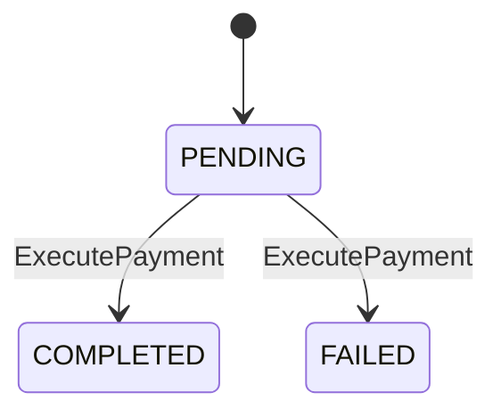

# [bc:ticketing][agg:Payment] Payment 集約（決済）

<!-- es-key: bc/ticketing/agg/Payment -->

## 実装担当範囲
- **BC (大項目)**: `bc:ticketing`
- **AGG (中項目)**: `agg:Payment`
- **スコープ**: この AGG の全 CMD / QRY / 受信 POLICY を 1 PR で実装
- **原則**: 1 AGG = 1 オーナー = 1 PR (AI エージェント 1 担当)
- **本 Epic 外**: AGG 跨ぎ統合 Issue で扱う処理は別 Issue（下記「AGG 跨ぎ統合 Issue への参加」参照）

## Aggregate 概要
決済 集約。

## スキーマ (Zod)

```typescript
export const PaymentSchema = z.object({
  id: PaymentIdSchema,
  applicationId: ApplicationIdSchema,
  amount: PriceSchema,
  status: z.enum(['PENDING', 'COMPLETED', 'FAILED']),
  externalProviderRef: z.string().nullable(),
  attemptedAt: z.date(),
  completedAt: z.date().nullable(),
});
export type Payment = z.infer<typeof PaymentSchema>;
```

## 不変条件 (RULE)
- amount は Ticket 発行時の priceSnapshot と一致する
- COMPLETED への遷移時 externalProviderRef が必須
- 同一 Application に対する Payment は最大 1 つの COMPLETED まで（リトライは別 Payment レコード）

## エラー (ERR)
- `PaymentAmountMismatchError`: amount が priceSnapshot と異なる
- `PaymentAlreadyCompletedError`: 既に COMPLETED 状態のため再決済不可

## 状態モデル

状態: `COMPLETED` | `FAILED` | `PENDING`

## 状態遷移 (State Transitions)



## 状態遷移を起こす CMD（一覧）

| from | to | CMD | Issue | RULE |
|---|---|---|---|---|
| `PENDING` | `COMPLETED` | `ExecutePayment` | (未起票) | 決済成功 |
| `PENDING` | `FAILED` | `ExecutePayment` | (未起票) | 決済失敗（カード期限切れ等） |

## 状態遷移を起こす CMD（詳細）

### `ExecutePayment` — `PENDING` → `COMPLETED`, `PENDING` → `FAILED`
- **由来シナリオ**: 決済成功
- **アクター**: `System`
- **適用 RULE**:
  - payment amount must match expected price
  - must not have existing COMPLETED Payment for same Application
- **想定 ERR**:
  - amountMismatch → PaymentAmountMismatchError
  - alreadyCompleted → PaymentAlreadyCompletedError

## 状態を変えない CMD（属性更新・一覧）

（なし）

## 状態を変えない CMD（詳細）

（なし）

## QRY（読み出し口・詳細）

（なし）

## 受信 POLICY (inbound: 他 AGG / BC の EVT に反応してこの AGG の CMD を発火)

### `ProcessPaymentForApplication`
- **TRIGGER EVT**: `ApplicationSubmitted` ← (発生元未解決)
- **発火 CMD** (この AGG 内): `ExecutePayment`
- **BULK**: false
- メモ: 申込発生で決済 Saga を開始

### `ProcessPaymentForPromotion` ⚠ **cross-BC**
- **TRIGGER EVT**: `WaitlistPromoted` ← `agg:Application` (`bc:registration`)
- **発火 CMD** (この AGG 内): `ExecutePayment`
- **BULK**: false
- メモ: 繰り上げ通知で決済 Saga を開始（24h 期限付き）
- **実装**: cross-BC は adapter/port パターンで分離し、上流 BC への直接依存を作らない

## 発信イベント (outbound: この AGG が発火する EVT とその消費先)

（なし — DML SCENARIO で EVT 紐付けが見つからない）

## 推奨モジュール構造

```
src/<bc>/<aggregate>/
  index.ts       — Aggregate root + 不変条件
  schema.ts      — Zod schemas
  commands/      — 1 CMD = 1 file
  queries/       — 1 QRY = 1 file
  events.ts      — EVT 定義
  errors.ts      — ERR 定義
  policies.ts    — 受信 POLICY ハンドラ
tests/<bc>/<aggregate>/<aggregate>.spec.ts
```

## 受け入れ条件
- [ ] Zod スキーマが Epic 記載と一致
- [ ] 状態遷移図の全エッジが実装されテストでカバー
- [ ] 全不変条件 (RULE) が enforce され、違反時に Epic 記載の ERR が発火
- [ ] 全 CMD / QRY が公開 API として動作
- [ ] 受信 POLICY 全件のハンドラが実装され、テストで TRIGGER EVT → CMD 発火が検証されている
- [ ] 発信 EVT 全件が CMD 成功時に確実に publish され、ペイロード schema が一致
- [ ] POLICY の冪等性（重複 EVT 受信時の重複 CMD 防止）がテストでカバー
- [ ] 上流 BC との依存が adapter / port パターンで分離（cross-BC POLICY 含む）
- [ ] AGG 跨ぎ統合 Issue で扱う処理は本 Epic 外（参照 link のみ）

## AGG 跨ぎ統合 Issue への参加
- （なし）

## Depends on
- 上流 BC: `bc:event-planning`, `bc:registration`
- 受信 POLICY 発生元 AGG: `agg:Application`

## Source
- セッション MD: `docs/eventstorming/eventstorming-20260515-1901.md`
