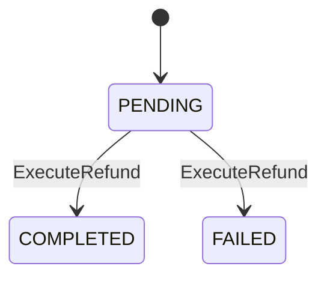

# [bc:ticketing][agg:Refund] Refund 集約（返金）

<!-- es-key: bc/ticketing/agg/Refund -->

## 実装担当範囲
- **BC (大項目)**: `bc:ticketing`
- **AGG (中項目)**: `agg:Refund`
- **スコープ**: この AGG の全 CMD / QRY / 受信 POLICY を 1 PR で実装
- **原則**: 1 AGG = 1 オーナー = 1 PR (AI エージェント 1 担当)
- **本 Epic 外**: AGG 跨ぎ統合 Issue で扱う処理は別 Issue（下記「AGG 跨ぎ統合 Issue への参加」参照）

## Aggregate 概要
返金 集約。

## スキーマ (Zod)

```typescript
export const RefundIdSchema = z.string().uuid().brand<'RefundId'>();

export const RefundSchema = z.object({
  id: RefundIdSchema,
  ticketId: TicketIdSchema,
  paymentId: PaymentIdSchema,
  amount: PriceSchema,
  reason: z.enum(['MEMBER_CANCEL', 'EVENT_CANCEL', 'EVENT_RESCHEDULE_REJECT', 'EVENT_REPRICE_REJECT']),
  status: z.enum(['PENDING', 'COMPLETED', 'FAILED']),
  externalProviderRef: z.string().nullable(),
  processedAt: z.date(),
});
export type Refund = z.infer<typeof RefundSchema>;
```

## 不変条件 (RULE)
- 元の Ticket は ISSUED または USED 状態（USED の場合は会場での参加後の特例返金）
- amount は Ticket.priceSnapshot と一致
- 同一 Ticket に対する Refund は最大 1 つの COMPLETED まで

## エラー (ERR)
- `RefundAlreadyProcessedError`: 既に返金済みの Ticket への再返金
- `TicketNotFoundError`: 元 Ticket が存在しない

## 状態モデル

状態: `COMPLETED` | `FAILED` | `PENDING`

## 状態遷移 (State Transitions)



## 状態遷移を起こす CMD（一覧）

| from | to | CMD | Issue | RULE |
|---|---|---|---|---|
| `PENDING` | `COMPLETED` | `ExecuteRefund` | (未起票) | 返金成功 |
| `PENDING` | `FAILED` | `ExecuteRefund` | (未起票) | 返金失敗（要手動対応） |

## 状態遷移を起こす CMD（詳細）

### `ExecuteRefund` — `PENDING` → `COMPLETED`, `PENDING` → `FAILED`
- **由来シナリオ**: 返金成功
- **アクター**: `System`
- **適用 RULE**:
  - original Ticket must exist and not already refunded
  - refund amount must equal Ticket.priceSnapshot
- **想定 ERR**:
  - alreadyRefunded → RefundAlreadyProcessedError
  - ticketNotFound → TicketNotFoundError

## 状態を変えない CMD（属性更新・一覧）

（なし）

## 状態を変えない CMD（詳細）

（なし）

## QRY（読み出し口・詳細）

（なし）

## 受信 POLICY (inbound: 他 AGG / BC の EVT に反応してこの AGG の CMD を発火)

### `RefundAllOnEventCancellation` ⚠ **cross-BC**
- **TRIGGER EVT**: `EventCancellationRequested` ← `agg:Event` (`bc:event-planning`)
- **QRY** (BULK 対象選択): `GetConfirmedApplications`
- **発火 CMD** (この AGG 内): `ExecuteRefund`
- **BULK**: true
- メモ: イベント中止で全 confirmed 申込を BULK 返金（reason = EVENT_CANCEL）
- **実装**: cross-BC は adapter/port パターンで分離し、上流 BC への直接依存を作らない

### `RefundOnApplicationCancellation` ⚠ **cross-BC**
- **TRIGGER EVT**: `ApplicationCancellationRequested` ← `agg:Application` (`bc:registration`)
- **発火 CMD** (この AGG 内): `ExecuteRefund`
- **BULK**: false
- メモ: キャンセル要求を受けて返金処理を起動（CMD ExecuteRefund は reason = MEMBER_CANCEL で発行）
- **実装**: cross-BC は adapter/port パターンで分離し、上流 BC への直接依存を作らない

## 発信イベント (outbound: この AGG が発火する EVT とその消費先)

（なし — DML SCENARIO で EVT 紐付けが見つからない）

## 推奨モジュール構造

```
src/<bc>/<aggregate>/
  index.ts       — Aggregate root + 不変条件
  schema.ts      — Zod schemas
  commands/      — 1 CMD = 1 file
  queries/       — 1 QRY = 1 file
  events.ts      — EVT 定義
  errors.ts      — ERR 定義
  policies.ts    — 受信 POLICY ハンドラ
tests/<bc>/<aggregate>/<aggregate>.spec.ts
```

## 受け入れ条件
- [ ] Zod スキーマが Epic 記載と一致
- [ ] 状態遷移図の全エッジが実装されテストでカバー
- [ ] 全不変条件 (RULE) が enforce され、違反時に Epic 記載の ERR が発火
- [ ] 全 CMD / QRY が公開 API として動作
- [ ] 受信 POLICY 全件のハンドラが実装され、テストで TRIGGER EVT → CMD 発火が検証されている
- [ ] 発信 EVT 全件が CMD 成功時に確実に publish され、ペイロード schema が一致
- [ ] POLICY の冪等性（重複 EVT 受信時の重複 CMD 防止）がテストでカバー
- [ ] 上流 BC との依存が adapter / port パターンで分離（cross-BC POLICY 含む）
- [ ] AGG 跨ぎ統合 Issue で扱う処理は本 Epic 外（参照 link のみ）

## AGG 跨ぎ統合 Issue への参加
- `integration/システムが返金を実行する.md` — システムが返金を実行する（他参加 AGG: `agg:Ticket`）

## Depends on
- 上流 BC: `bc:event-planning`, `bc:registration`
- 受信 POLICY 発生元 AGG: `agg:Application`, `agg:Event`
- 統合 Issue: `integration/システムが返金を実行する.md`

## Source
- セッション MD: `docs/eventstorming/eventstorming-20260515-1901.md`
