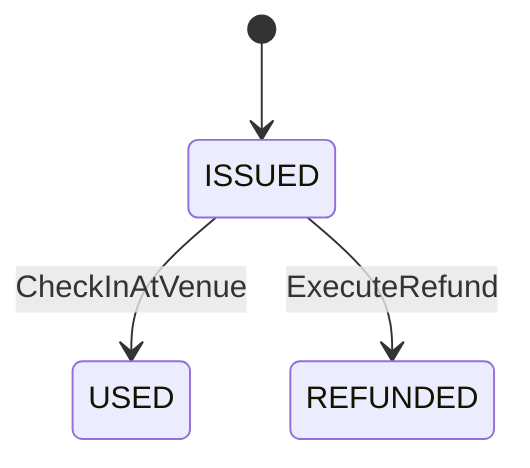

# [bc:ticketing][agg:Ticket] Ticket 集約（チケット）

<!-- es-key: bc/ticketing/agg/Ticket -->

## 実装担当範囲
- **BC (大項目)**: `bc:ticketing`
- **AGG (中項目)**: `agg:Ticket`
- **スコープ**: この AGG の全 CMD / QRY / 受信 POLICY を 1 PR で実装
- **原則**: 1 AGG = 1 オーナー = 1 PR (AI エージェント 1 担当)
- **本 Epic 外**: AGG 跨ぎ統合 Issue で扱う処理は別 Issue（下記「AGG 跨ぎ統合 Issue への参加」参照）

## Aggregate 概要
チケット 集約。

## スキーマ (Zod)

```typescript
export const TicketIdSchema = z.string().uuid().brand<'TicketId'>();
export const PaymentIdSchema = z.string().uuid().brand<'PaymentId'>();

export const TicketSchema = z.object({
  id: TicketIdSchema,
  applicationId: ApplicationIdSchema,
  eventId: EventIdSchema,
  memberId: MemberIdSchema,
  paymentId: PaymentIdSchema,
  participationType: ParticipationTypeSchema,
  priceSnapshot: PriceSchema,
  memberAtPurchase: z.boolean(),
  status: z.enum(['ISSUED', 'USED', 'REFUNDED']),
  issuedAt: z.date(),
});
export type Ticket = z.infer<typeof TicketSchema>;
```

## 不変条件 (RULE)
- 対応する Payment が COMPLETED 状態である
- `priceSnapshot` は発行時の Event 料金を凍結保持
- `memberAtPurchase` は発行時のコミュニティメンバー状態を凍結保持
- ISSUED 状態の Ticket のみ USED または REFUNDED に遷移可能
- 1 つの Application に対応する Ticket は 1 つまで

## エラー (ERR)
- `InvalidTicketError`: 存在しない or 既に REFUNDED の Ticket での受付試行
- `TicketAlreadyUsedError`: USED の Ticket での二重受付

## 状態モデル

状態: `ISSUED` | `REFUNDED` | `USED`

## 状態遷移 (State Transitions)



## 状態遷移を起こす CMD（一覧）

| from | to | CMD | Issue | RULE |
|---|---|---|---|---|
| `ISSUED` | `USED` | `CheckInAtVenue` | (未起票) | 受付完了またはオンライン参加開始 |
| `ISSUED` | `REFUNDED` | `ExecuteRefund` | (未起票) | 返金完了 |

## 状態遷移を起こす CMD（詳細）

### `CheckInAtVenue` — `ISSUED` → `USED`
- **由来シナリオ**: 受付完了またはオンライン参加開始
- **アクター**: `Member`
- **発火 EVT**: `CheckedIn`
- **適用 RULE**:
  - Ticket must be valid and matching event
  - Ticket.participationType must be VENUE
  - recordedAt must be within event time window
  - Ticket must not already have Attendance
- **想定 ERR**:
  - invalidTicket → InvalidTicketError
  - wrongType → ParticipationTypeMismatchError
  - wrongTime → NotTodayError
  - alreadyCheckedIn → AlreadyCheckedInError

### `ExecuteRefund` — `ISSUED` → `REFUNDED`
- **由来シナリオ**: 返金完了
- **アクター**: `System`
- **適用 RULE**:
  - original Ticket must exist and not already refunded
  - refund amount must equal Ticket.priceSnapshot
- **想定 ERR**:
  - alreadyRefunded → RefundAlreadyProcessedError
  - ticketNotFound → TicketNotFoundError

## 状態を変えない CMD（属性更新・一覧）

| CMD | 由来シナリオ | Issue |
|---|---|---|
| `IssueTicket` | システムがチケットを発行する | (未起票) |

## 状態を変えない CMD（詳細）

### `IssueTicket`
- **由来シナリオ**: システムがチケットを発行する
- **アクター**: `System`
- **発火 EVT**: `TicketIssued`
- **適用 RULE**:
  - payment must have been completed
  - ticket must capture priceSnapshot and memberAtPurchase
- **連鎖 POLICY**: `ConfirmApplicationOnTicketIssued`

## QRY（読み出し口・詳細）

（なし）

## 受信 POLICY (inbound: 他 AGG / BC の EVT に反応してこの AGG の CMD を発火)

### `IssueTicketOnPaymentSuccess`
- **TRIGGER EVT**: `PaymentCompleted` ← (発生元未解決)
- **発火 CMD** (この AGG 内): `IssueTicket`
- **BULK**: false
- メモ: 決済成功でチケット発行

## 発信イベント (outbound: この AGG が発火する EVT とその消費先)

### EVT `TicketIssued`
- **発火 CMD** (この AGG 内): `IssueTicket`
- **消費 POLICY**:
  - `ConfirmApplicationOnTicketIssued` → `agg:Application.ConfirmApplication` (`bc:registration`) ⚠ cross-BC

## 推奨モジュール構造

```
src/<bc>/<aggregate>/
  index.ts       — Aggregate root + 不変条件
  schema.ts      — Zod schemas
  commands/      — 1 CMD = 1 file
  queries/       — 1 QRY = 1 file
  events.ts      — EVT 定義
  errors.ts      — ERR 定義
  policies.ts    — 受信 POLICY ハンドラ
tests/<bc>/<aggregate>/<aggregate>.spec.ts
```

## 受け入れ条件
- [ ] Zod スキーマが Epic 記載と一致
- [ ] 状態遷移図の全エッジが実装されテストでカバー
- [ ] 全不変条件 (RULE) が enforce され、違反時に Epic 記載の ERR が発火
- [ ] 全 CMD / QRY が公開 API として動作
- [ ] 受信 POLICY 全件のハンドラが実装され、テストで TRIGGER EVT → CMD 発火が検証されている
- [ ] 発信 EVT 全件が CMD 成功時に確実に publish され、ペイロード schema が一致
- [ ] POLICY の冪等性（重複 EVT 受信時の重複 CMD 防止）がテストでカバー
- [ ] 上流 BC との依存が adapter / port パターンで分離（cross-BC POLICY 含む）
- [ ] AGG 跨ぎ統合 Issue で扱う処理は本 Epic 外（参照 link のみ）

## AGG 跨ぎ統合 Issue への参加
- `integration/システムが返金を実行する.md` — システムが返金を実行する（他参加 AGG: `agg:Refund`）
- `integration/参加者が会場で受付する.md` — 参加者が会場で受付する（他参加 AGG: `agg:Attendance`）
- `integration/参加者がオンラインで参加する.md` — 参加者がオンラインで参加する（他参加 AGG: `agg:Attendance`）

## Depends on
- 上流 BC: `bc:event-planning`, `bc:registration`
- 統合 Issue: `integration/システムが返金を実行する.md`, `integration/参加者が会場で受付する.md`, `integration/参加者がオンラインで参加する.md`

## Source
- セッション MD: `docs/eventstorming/eventstorming-20260515-1901.md`
